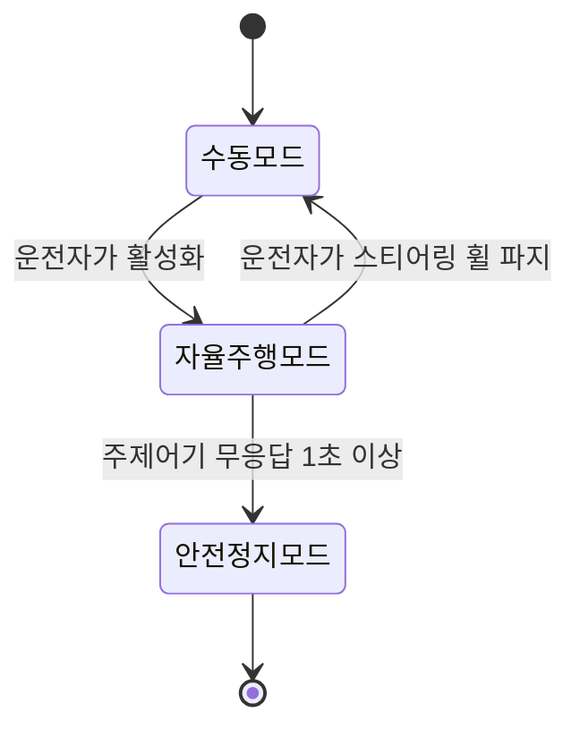
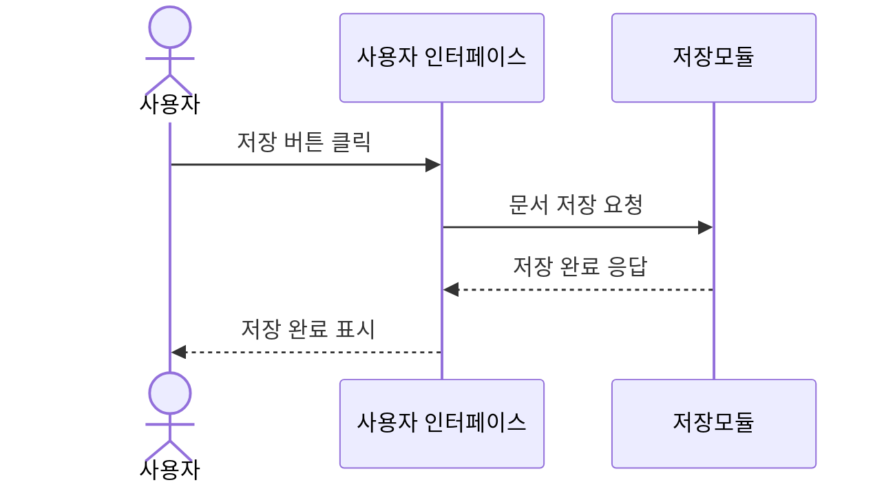

# UML/SysML을 이용한 기능 요구사항 표현

기능 요구사항은 텍스트만으로는 동작 흐름이나 상태 전이, 구성요소 간 관계가 직관적으로 전달되지 않는 경우가 많습니다. 이 참조 파일은 어떤 요구사항 유형에 어떤 UML/SysML 다이어그램이 적합한지, 그리고 텍스트 환경(Markdown)에서 이를 어떻게 표현할지 정리합니다.

**표현 방법**: 이 프로젝트는 이미지 편집 도구가 없는 텍스트 기반 환경이므로, 다이어그램은 **Mermaid** 또는 **PlantUML** 문법으로 코드 블록에 작성합니다. Mermaid는 GitHub/많은 Markdown 뷰어에서 바로 렌더링되므로 기본으로 우선 사용하고, SysML 고유 표기(요구사항 다이어그램, 블록 정의 다이어그램 등)가 꼭 필요한 경우에만 PlantUML(SysML 확장 문법 포함)을 사용하세요.

## 요구사항 유형별 추천 다이어그램

| 요구사항 성격 | 추천 다이어그램 | 이유 |
|---|---|---|
| 사용자/외부 시스템과의 상호작용 범위 | Use Case Diagram (UML) | 누가(액터) 무엇을(유스케이스) 하는지 한눈에 파악 |
| 여러 단계로 이어지는 처리 흐름 (이벤트 기반 요구) | Activity Diagram (UML) | 분기/병렬 처리를 포함한 절차를 표현 |
| 상태 기반 요구사항 (WHILE 패턴) | State Machine Diagram (UML) | 상태와 전이 조건을 명시적으로 표현 |
| 구성요소 간 메시지 교환 순서 | Sequence Diagram (UML) | 시간 순서에 따른 상호작용을 표현 — 인터페이스 요구사항에 적합 |
| 시스템 구조/구성요소 분해 | Block Definition Diagram, BDD (SysML) | 시스템을 구성하는 블록(부품)과 계층 관계 표현 |
| 구성요소 간 연결/인터페이스 | Internal Block Diagram, IBD (SysML) | 블록 간 포트와 흐름(신호/데이터/에너지)을 표현 |
| 요구사항 간 관계 (derive, satisfy, verify, refine, trace) | Requirement Diagram (SysML) | 요구사항 계층과 추적 관계를 시각화 — **양방향 추적성 문서화에 특히 유용** |
| 파라미터/제약 관계 (성능, 물리량 계산) | Parametric Diagram (SysML) | 비기능 요구사항의 수치 제약 간 관계 표현 |

## Mermaid 예시

### 상태 기반 요구사항 (WHILE 패턴 → State Diagram)



### 이벤트 기반 요구사항 (WHEN 패턴 → Sequence Diagram)



### 요구사항 추적 관계 (SysML Requirement Diagram — PlantUML)

```plantuml
@startuml
requirement "안전목표: 충돌 회피" as SG1
requirement "FSR: 전방 장애물 감지 시 제동" as FSR1
requirement "SW 요구사항: 200ms 이내 제동 명령 전송" as SWR1
testCase "TC-001: 제동 응답시간 측정" as TC1

SG1 <- FSR1 : derive
FSR1 <- SWR1 : derive
SWR1 <- TC1 : verify
@enduml
```

## 작성 절차

1. 요구사항의 성격(구조/행위/상호작용/상태/추적관계)을 먼저 판단해 위 표에서 적합한 다이어그램을 선택합니다.
2. 모든 기능 요구사항에 다이어그램을 강제로 그리지 마세요 — 복잡도가 낮아 텍스트만으로 충분히 명확한 요구사항(예: 단순 유비쿼터스 요구)까지 다이어그램화하면 오히려 유지보수 부담만 커집니다. 여러 단계/상태/구성요소가 얽힌 요구사항에 한해 다이어그램을 추가하세요.
3. 다이어그램은 요구사항 텍스트를 대체하지 않고 보완합니다 — 항상 EARS 문장(텍스트)과 다이어그램을 함께 제시하고, 다이어그램에 등장하는 요소명(상태명, 메시지명 등)이 요구사항 문장의 용어와 정확히 일치하도록 합니다 (불일치 시 추적성이 깨집니다).
4. SysML Requirement Diagram은 양방향 추적성(`analysis-process.md`의 추적성 확립 절차)을 시각적으로 검증하는 데 사용하세요 — derive/satisfy/verify 관계가 끊긴 노드가 있는지 다이어그램에서 바로 확인할 수 있습니다.
