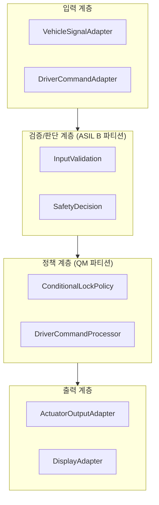
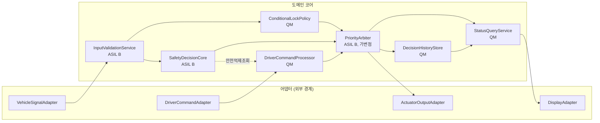
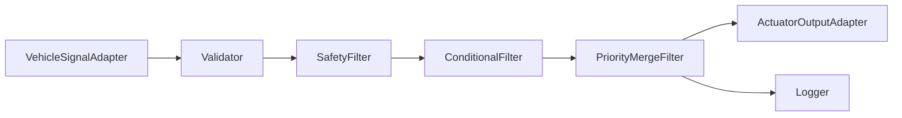
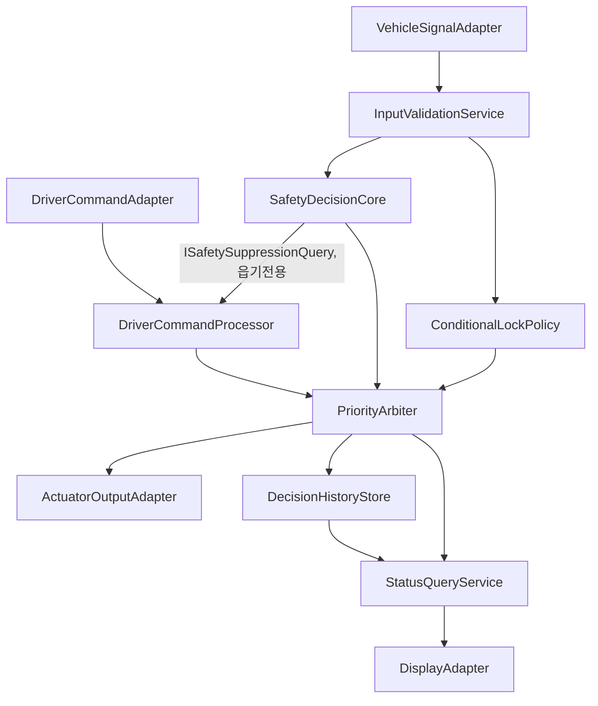
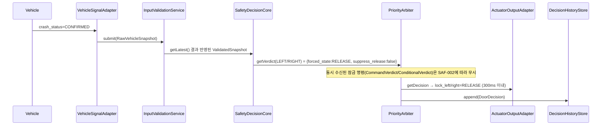
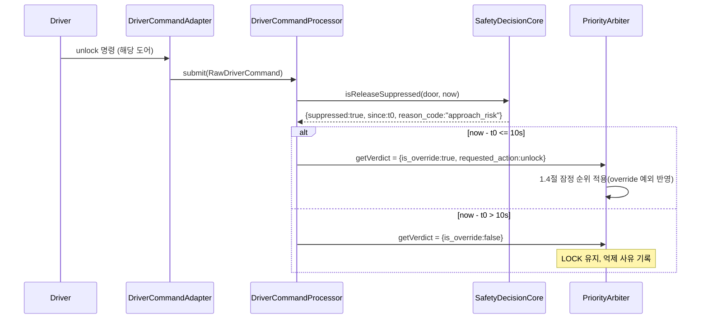
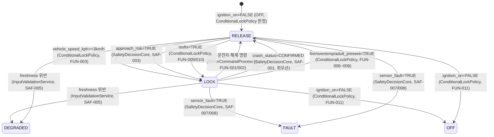

# SWA-001_SW 아키텍처 설계서

**후석 좌/우 전자식 차일드락 제어 SW**

| 항목 | 내용 |
|---|---|
| 문서 ID / 문서명 | SWA-001_SW 아키텍처 설계서 |
| Revision | 0.2 (Draft) |
| 프로세스 | A-SPICE 4.1 SWE.2 |
| 작성일 | 2026-09-18 |
| 입력 문서 | SWR-001_SW 요구사항 명세서 (Rev 0.1, Draft), TPL-SWE2-001_SW 아키텍처 설계서 템플릿 |
| 작성 조직/역할 | architecture-designer 서브에이전트 (Claude Code) |
| 문서 상태 | 0.2 Draft — **아키텍처 구조 후보는 사용자가 후보 2(포트-어댑터/헥사고날 + 정책 컴포넌트 분리)로 확정**(2026-09-18). 아울러 Phase 2를 2a(SafetyDecisionCore)/2b(PriorityArbiter)로 세분하는 것도 사용자 승인 완료. 3~14장은 이 확정 사항을 반영한 상태이며, 별도의 기술 검토/공식 승인 절차는 아직 수행되지 않아 Draft를 유지한다. |

> **교육/검토 경계**: 본 문서는 SWR-001과 동일하게 품질평가 실습을 위한 가상 프로젝트 산출물이다. 실제 승인, A-SPICE 능력수준, ISO 26262 준수/인증, 양산 적합성을 나타내지 않는다. HARA/ASIL 도출은 재수행하지 않으며, ASIL B는 SWR-001에서 승계된 값을 그대로 사용한다.

## 문서 통제

| 단계 | 책임 역할 | 상태 | 비고 |
|---|---|---|---|
| 작성 | architecture-designer 서브에이전트 (Claude Code) | 완료 (Draft) | SWR-001 Rev 0.1 입력 기반 |
| 아키텍처 구조 후보 선정 | 사용자 | **완료 — 후보 2 확정** | 3장 후보 비교표 중 후보 2(포트-어댑터+정책분리) 명시적 선택 (2026-09-18), Phase 2a/2b 세분 승인 포함 |
| 기술 검토 | (미지정) | 미수행 | 1인 바이브 코딩 단계 |
| 승인 | (미지정) | 미수행 | 승인 전까지 Draft 유지 |

### 변경 이력

| Revision | 일자 | 작성/변경자 | 변경 내용 |
|---|---|---|---|
| 0.1 | 2026-09-18 | architecture-designer 서브에이전트 (Claude Code) | SWR-001 기반 최초 작성. 아키텍처 후보 3안 제시, 후보 2(포트-어댑터+정책분리)를 가정하여 3~14장 상세 초안 작성 |
| 0.2 | 2026-09-18 | architecture-designer 서브에이전트 (Claude Code) | 사용자 확정 사항 반영: (1) 아키텍처 구조 후보 2(포트-어댑터/헥사고날+정책 컴포넌트 분리)로 확정 — 3장/1장의 "잠정/후보 미선정" 조건부 표현 제거. (2) PriorityArbiter 신설 및 Phase 2를 2a(SafetyDecisionCore)/2b(PriorityArbiter)로 세분하는 것을 확정 — 4.7절, 10.2절, 11.2절의 Phase 표기를 2a/2b로 갱신 |

---

## 1. 목적 및 적용범위

### 1.1 목적

본 문서는 SWR-001(SW 요구사항 명세서 Rev 0.1)에 정의된 SW 요구사항(SWR-SAF-001~008, SWR-FUN-001~011, SWR-NFR-001~004)을 만족하는 소프트웨어 아키텍처를 정의한다. A-SPICE 4.1 SWE.2와 ISO 26262-6 소프트웨어 아키텍처 설계 원칙(HARA/ASIL 도출은 제외, Part 6 설계 원칙만 적용)에 따라 컴포넌트 분해, 인터페이스, 정적 의존성, 동적 동작, 오류 격리, 통합 전략, 추적성을 정의하며, 이후 SWE.3(상세설계)·SWE.4(구현/단위시험)·SWE.5(통합시험)의 입력이 된다.

### 1.2 적용범위

- SWR-001과 동일: 후석 좌/우 전자식 차일드락 제어 SW, ASIL B 안전 관련 요구(SAF) + QM 기능/비기능 요구(FUN/NFR)
- SW-only PC/SIL(Python 3.14) 참조 구현 및 Web 시뮬레이터를 대상 배포 환경으로 한다
- ECU/HW, RTOS, HIL, 실차, 공식 인증 활동은 범위에서 제외한다 (SWR-001 1.3절 경계 승계)

### 1.3 적용 경계

| 경계 항목 | 적용 여부 | 비고 |
|---|---|---|
| SW-only PC/SIL 및 Web 검증 | 적용 | 결정론적 참조 구현(NFR-001) |
| ECU/HW, RTOS, HIL, 실차 | 제외 | SWR-001 경계 승계 |
| ISO 26262 Part 3 (HARA/ASIL 도출) | 제외 | ASIL B는 SWR-001에서 이미 승계된 값 |
| ISO 26262-6 아키텍처 설계 원칙 | 적용 | 모듈화/캡슐화/결합도·응집도/오류격리/ASIL 독립성 논증 (교육용 선정 적용) |
| 실행 환경 | Python 3.14 (PC/SIL) | SWR-001 7.1절 승계 |

### 1.4 상위 요구사항 우선순위에 대한 잠정 전제 (필수 명시)

SWR-001 3.2절 및 8장 A-05는 "충돌 확정 해제가 최우선"이라는 점만 확정이고, 그 외 조건(접근위험 LOCK / 화재·과온·성인탑승 RELEASE / ISOFIX LOCK / 운전자 override) 간 상호 우선순위는 **TBD — OEM-A 확인 필요**로 명시되어 있다. 본 아키텍처 문서는 사용자와 사전 합의된 바에 따라 SWR-001 3.2절의 **제안 순위(잠정안)**를 그대로 가정하여 설계하며, 이는 **TBD로 남겨진 상위 요구사항에 근거한 잠정 설계**임을 명시한다. 확정 시 4.7절(PriorityArbiter, 가변점)만 수정하면 되도록 격리했다 (10.2절 참조).

---

## 2. 아키텍처 설계 원칙

`architecture-design` 스킬의 `architecture-principles.md`, `solid-and-coupling-cohesion.md`, `interface-design.md`를 이 프로젝트에 다음과 같이 적용한다.

### 2.1 모듈화/캡슐화

- 모든 컴포넌트는 단일 책임(4장에서 응집도 유형과 함께 근거 기록)을 갖는다.
- 컴포넌트 내부 데이터 구조(예: `ValidatedSnapshot`, `SafetyVerdict`)는 컴포넌트 경계를 넘어 직접 노출되지 않으며, 인터페이스가 정의한 값 객체(Value Object)로만 교환된다.

### 2.2 결합도/응집도 — 필수 준수

- 목표 결합: **데이터 결합**만 허용. 제어 결합(동작을 바꾸는 플래그 전달)은 지양하되, 부득이한 경우(예: `action=lock/unlock`) enum 값 객체로 한정하고 컴포넌트 내부 분기 로직이 아닌 정책 컴포넌트(4.6절)에 위임한다.
- **공통 결합(전역 변수/공유 메모리) 및 내용 결합(타 컴포넌트 내부 직접 접근) 금지** — 5장 정적 의존성 및 6장 인터페이스 명세로 전수 확인한다.
- 목표 응집: **기능적 응집**. 각 컴포넌트는 "이 컴포넌트가 존재하는 단 하나의 이유"를 4장에 한 문장으로 명시한다.

### 2.3 SOLID

- **SRP**: 4장 각 컴포넌트마다 "이 컴포넌트를 변경해야 하는 이유"를 1개로 한정해 기록.
- **OCP**: 가변점(1.4절 우선순위, 향후 명령 source 추가 등)은 정책/어댑터 컴포넌트 뒤로 격리해, 신규 조건/신규 source 추가 시 기존 컴포넌트 수정 없이 확장 가능하도록 한다 (10.2절 변경 유연성 시나리오).
- **LSP**: `IDoorCommandSource`(4.5절) 등 복수 구현체(물리버튼/AVN/음성/모바일앱 어댑터)가 존재하는 인터페이스는 사전/사후조건을 동일하게 유지한다 (6.1절).
- **ISP**: `PriorityArbiter`가 필요로 하는 조회 인터페이스(안전 억제 여부)와 `DriverCommandProcessor`가 필요로 하는 조회 인터페이스를 분리해, 서로 사용하지 않는 오퍼레이션에 의존하지 않게 한다.
- **DIP**: 상위 정책 컴포넌트(PriorityArbiter)는 하위 어댑터의 구체 구현(예: 특정 통신 프로토콜)이 아니라 포트 인터페이스에만 의존한다.

### 2.4 인터페이스 전용 통신 — 필수 준수

- 모든 컴포넌트 간 상호작용은 6장에 정의된 인터페이스(제공/요구)로만 표현한다. 인터페이스 없는 화살표, 직접 필드 접근, 전역 상태 공유는 설계에 포함하지 않는다.
- 외부 인터페이스(OEM-IF-001~009)는 어댑터 컴포넌트(4.1, 4.5, 4.9, 4.11절) 뒤로 격리해 내부 정책/도메인 컴포넌트가 외부 스키마 변경에 직접 노출되지 않도록 한다.

### 2.5 오류 격리 / ASIL 독립성 (개요, 상세는 9장)

- ASIL B 컴포넌트(입력 검증 中 안전 필수 입력분, 안전 결정 로직, 우선순위 조정자)는 QM 컴포넌트로부터 **읽기 전용 조회 인터페이스**로만 참조되며, QM 컴포넌트가 ASIL B 컴포넌트의 상태를 직접 변경할 수 있는 경로는 존재하지 않는다.
- ASIL 배분표(컴포넌트별)는 4장에 명시하며, 배분 근거가 없는 경우 TBD로 표시한다.

---

## 3. 논리 아키텍처 — 아키텍처 구조 후보 및 선정 결과 (사용자 확정 완료)

`architecture-style-candidates.md` 절차에 따라 3개 후보를 제시했고, **사용자가 후보 2(포트-어댑터/헥사고날 + 정책 컴포넌트 분리)를 명시적으로 확정했다(2026-09-18)**. 이하 후보 1/3의 비교 내용은 선정 근거를 보여주기 위해 그대로 보존하며, 4장 이후는 확정된 후보 2를 기준으로 작성되어 있다.

### 후보 1 — 계층형 + ASIL 파티셔닝 (Layered + Safety Partitioning)

- **장점**: 계층 간 의존 방향이 단순(상→하 단방향)해 이해하기 쉽고, ASIL B/QM 파티션을 계층으로 분리해 ISO 26262 독립성 논증이 직관적.
- **단점/리스크**: 우선순위 조정(1.4절 가변점)이 어느 계층에 속하는지 애매해질 수 있음(정책 계층과 판단 계층에 걸침). 계층을 관통하는 변경(예: override 규칙 변경)이 여러 계층에 파급될 위험.
- **결합도/응집도**: 계층 내부는 기능적 응집 가능하나 계층 경계가 넓어 통신적 응집으로 흐를 위험.
- **SOLID**: OCP는 계층 내부 확장에는 유리하나, 계층을 넘는 신규 규칙 추가 시 여러 계층 동시 수정 위험(OCP 약화).
- **ASIL 독립성**: 파티션 경계가 명확해 논증 용이.

### 후보 2 — 포트-어댑터(헥사고날) + 정책 컴포넌트 분리 [사용자 확정]

- **장점**: 외부 인터페이스(OEM-IF-001~009) 변경/HW 교체 가능성이 어댑터 뒤로 완전히 격리(DIP 자연 실현). 우선순위 조정 로직을 `PriorityArbiter` 단일 컴포넌트로 명시적으로 격리해 1.4절 가변점(A-05)에 정확히 대응. 6-Phase 개발 계획과 컴포넌트 경계가 1:1에 가깝게 대응.
- **단점/리스크**: 어댑터-코어 간 포트 정의가 초기에 다소 늘어남(설계 복잡도 소폭 증가). 컴포넌트 수가 후보 1보다 많음.
- **결합도/응집도**: 각 코어 컴포넌트가 기능적 응집(단일 책임)을 갖도록 세분화되어 가장 낮은 결합도 달성 가능.
- **SOLID**: OCP·DIP가 가장 잘 실현됨 (신규 명령 source 추가 = 어댑터 추가만, 우선순위 변경 = PriorityArbiter만 수정).
- **ASIL 독립성**: ASIL B 컴포넌트(InputValidationService, SafetyDecisionCore, PriorityArbiter)가 QM 컴포넌트로부터 읍기 전용 인터페이스로만 참조되어 독립성 논증이 가장 명확.

### 후보 3 — 파이프-필터 (순차 처리 파이프라인)

- **장점**: NFR-001(결정론적 재현성)과 정합성이 높음 — 각 필터가 순수 함수적 변환이면 재현성 입증이 쉬움. 데이터 흐름이 매우 명확.
- **단점/리스크**: 도어별 `LOCK/RELEASE/DEGRADED/FAULT/OFF` **상태**를 누가 소유하는지 애매(파이프라인은 상태보다 흐름 중심) — 상태 소유 컴포넌트를 별도로 두지 않으면 상태가 여러 필터에 암묵적으로 분산되어 결합도가 오히려 높아질 위험. 운전자 override(FUN-004, 10초 시간창)처럼 시간에 걸친 상태 유지가 필요한 요구를 필터 체인으로 표현하기 어려움.
- **결합도/응집도**: 필터 간 순차적 응집(허용 수준)이나, override/상태 보존 로직이 필터에 섞이면 절차적 응집으로 저하될 위험.
- **SOLID**: 신규 필터 추가는 OCP에 유리하나, 상태 보존 로직 배치가 애매해 SRP가 흔들릴 위험.
- **ASIL 독립성**: 필터 체인 특성상 ASIL B/QM 필터가 순서상 인접하게 배치되어 파티션 경계가 상대적으로 불명확.

### 비교 요약

| 관점 | 후보 1 (계층형+파티셔닝) | 후보 2 (포트-어댑터+정책분리) | 후보 3 (파이프-필터) |
|---|---|---|---|
| 결합도 | 중 (계층 경계 넓음) | 낮음 (컴포넌트별 세분화) | 중~높음 (상태 소유 애매) |
| 응집도 | 중 | 높음 (기능적 응집) | 중 (절차적 응집 위험) |
| OCP/DIP | 중 | 높음 | 중 |
| A-05 가변점 격리 | 애매 | 명확 (PriorityArbiter 단일 지점) | 애매 (필터에 분산 위험) |
| ASIL 독립성 논증 | 용이 | 가장 용이 | 상대적으로 어려움 |
| 6-Phase 대응 | 대체로 대응 | 가장 자연스럽게 대응 | 부분 대응(상태 보존 이슈) |

### 선정 결과

**확정안: 후보 2 (포트-어댑터 + 정책 컴포넌트 분리)** — 사용자가 2026-09-18에 명시적으로 확정했다. 근거: (a) SWR-001 6장 OEM-IF-001~009 외부 인터페이스 경계와 어댑터 경계가 자연스럽게 일치, (b) 1.4절 가변점(A-05 우선순위 TBD)을 PriorityArbiter 단일 컴포넌트로 격리 가능, (c) 사용자가 사전 정의한 6-Phase 개발 계획과 컴포넌트 경계가 가장 잘 대응(이번 확정에서 Phase 2를 2a/2b로 세분하는 것도 함께 승인됨, 10.2/11.2절 참조), (d) 결합도/응집도/SOLID 평가에서 가장 우수.

이하 4장~14장은 **확정된 후보 2**를 기준으로 작성되어 있다.

---

## 4. 컴포넌트 책임

각 컴포넌트는 응집도 유형(목표: 기능적 응집), 단일 책임(SRP) 근거, ASIL 배분, 의존 인터페이스(구체 컴포넌트가 아닌 인터페이스만, DIP 준수)를 함께 기록한다. 6-Phase 개발 계획과의 대응관계를 각 절 제목에 표기한다.

### 4.1 VehicleSignalAdapter (외부 어댑터, QM)

- **책임(단일 문장)**: OEM-IF-001/002/003/007/008/009로 수신한 차량 신호 원시값을 내부 값 객체 `RawVehicleSnapshot`으로 변환한다.
- **응집도**: 기능적 응집(외부 스키마→내부 값 객체 변환만 수행).
- **의존**: 외부 인터페이스(6.2절)만 의존. 내부 컴포넌트에 대한 지식 없음(요구 인터페이스: `IValidatedSnapshotSink`만 알고 구체 구현 모름).
- **6-Phase 대응**: Phase 1(입력 전처리)의 입력측.
- **변경 이유(SRP)**: 차량 신호 통신 스키마가 바뀌는 경우에만 변경.

### 4.2 DriverCommandAdapter (외부 어댑터, QM)

- **책임**: OEM-IF-004(physical_button/avn/voice/mobile_app)로 수신한 명령을 내부 값 객체 `RawDriverCommand`로 변환하고, enum(side/action/source) 미등록 값은 즉시 거절한다.
- **응집도**: 기능적 응집.
- **6-Phase 대응**: Phase 3(운전자 명령 처리)의 입력측.
- **변경 이유(SRP)**: 명령 입력 채널(예: 신규 source 추가) 변경 시에만 수정 — 후보 2의 OCP 근거.

### 4.3 InputValidationService (ASIL B)

- **책임**: `RawVehicleSnapshot`에 대해 SWR-SAF-005(freshness, 200ms 초과 시 100ms 이내 DEGRADED)와 SWR-SAF-006(형식/범위 오류 → INVALID)을 평가해 `ValidatedSnapshot`(입력 유효성 플래그 포함)을 산출한다.
- **응집도**: 기능적 응집(검증만 수행, 판단/정책 로직 없음).
- **ASIL**: B (SAF-005/006 승계).
- **6-Phase 대응**: Phase 1 전체.
- **변경 이유(SRP)**: freshness/범위 판정 기준이 바뀔 때만 변경.

### 4.4 SafetyDecisionCore (ASIL B)

- **책임**: `ValidatedSnapshot`을 입력으로 SWR-SAF-001/002(충돌 확정 해제 및 유지), SWR-SAF-003/004(접근위험 LOCK 및 해제 억제), SWR-SAF-007/008(센서 고장 시 직전 출력 유지 및 FAULT)을 평가해 도어별 `SafetyVerdict`(강제 값 또는 "제약 없음")를 산출한다.
- **응집도**: 기능적 응집(안전 필수 판단만 수행, 우선순위 병합은 하지 않음 — PriorityArbiter로 위임해 SRP 유지).
- **ASIL**: B.
- **6-Phase 대응**: Phase 2a 핵심.
- **변경 이유(SRP)**: ASIL B 안전 요구(SAF-001~004, 007~008) 자체가 변경될 때만 변경.
- **제공 인터페이스**: `ISafetyVerdictProvider`(PriorityArbiter용), `ISafetySuppressionQuery`(DriverCommandProcessor의 override 판단용 읍기 전용 조회).

### 4.5 DriverCommandProcessor (QM)

- **책임**: `RawDriverCommand`를 SWR-FUN-001/002에 따라 지정 도어에만 적용 가능한 `CommandVerdict`로 변환하고, SWR-FUN-004(10초 이내 재입력 override)를 판정한다. override 판정 시 `ISafetySuppressionQuery`(4.4절)를 조회하되 `SafetyDecisionCore` 내부 상태에는 접근하지 않는다.
- **응집도**: 기능적 응집.
- **ASIL**: QM.
- **6-Phase 대응**: Phase 3.
- **변경 이유(SRP)**: 명령 적용 규칙/override 규칙 변경 시.

### 4.6 ConditionalLockPolicy (QM)

- **책임**: `ValidatedSnapshot`을 입력으로 SWR-FUN-003(자동 잠금), SWR-FUN-006/007/008(화재/과온/성인탑승 강제 해제), SWR-FUN-009/010(ISOFIX 강제 잠금), SWR-FUN-011(ignition-off 초기화)을 평가해 `ConditionalVerdict`를 산출한다.
- **응집도**: 기능적 응집("조건부 강제 잠금/해제 정책 평가"라는 하나의 목적으로 통일 — 개별 조건 로직은 내부 전략 함수로 분리해 상세설계 단계에서 추가 세분화 가능).
- **ASIL**: QM (SWR-001 A-06에 따라 화재/과온/성인탑승도 OEM 원문상 QM 유지, 임의 상향 없음).
- **6-Phase 대응**: Phase 4.
- **변경 이유(SRP)**: 조건부 잠금/해제 규칙(신규 조건 추가 등) 변경 시.

### 4.7 PriorityArbiter (ASIL B, 가변점 격리 컴포넌트)

- **책임**: 도어별 `SafetyVerdict`(4.4) / `CommandVerdict`(4.5) / `ConditionalVerdict`(4.6)를 SWR-001 3.2절의 잠정 우선순위(1.4절)에 따라 병합해 최종 `DoorDecision`(state, lock_left/right, reason_code, priority_reason)을 산출한다.
- **응집도**: 기능적 응집("여러 판단 결과의 우선순위 병합"이라는 단일 목적).
- **ASIL**: B — SWR-SAF-002("이 기간 중 모든 잠금 명령을 적용하지 않아야 한다")가 병합 로직 자체에 대한 안전 요구이므로, 병합 컴포넌트도 ASIL B로 분류한다. QM 입력(CommandVerdict/ConditionalVerdict)을 받지만 이는 표준적인 ASIL B 컴포넌트의 입력 검증 책임 범위 내이며, 4.3절 InputValidationService가 선행 검증을 수행한다.
- **6-Phase 대응**: Phase 2b(신설, 사용자 확정 — 10.2절 참조). 원 6-Phase 계획에서는 PriorityArbiter가 명시적 컴포넌트로 분리되어 있지 않았으나, Phase 2를 2a(SafetyDecisionCore)/2b(PriorityArbiter)로 세분하는 것을 사용자가 확정했다. Phase 2b 완료 조건에 "PriorityArbiter의 SAF-001/002 우선순위 강제" 시나리오를 포함해야 한다.
- **가변점**: SWR-001 8장 A-05(우선순위 TBD)의 유일한 반영 지점. OEM-A 확정 시 본 컴포넌트 내부의 우선순위 테이블/전략만 교체하면 되며, 다른 컴포넌트의 인터페이스는 변경되지 않는다(OCP).
- **변경 이유(SRP)**: 우선순위 규칙(A-05 확정, override 정책 변경 등) 변경 시에만 변경.

### 4.8 DecisionHistoryStore (QM)

- **책임**: `DoorDecision`을 SWR-NFR-002(최근 100건 ring buffer)·NFR-003(영상/음성/PII 미저장, 필드 화이트리스트)·NFR-004(프로세스 재기동 시 휘발)에 따라 메모리 내 저장/조회한다.
- **응집도**: 기능적 응집.
- **ASIL**: QM.
- **6-Phase 대응**: Phase 6.
- **변경 이유(SRP)**: 로그 보존 정책(건수, 필드 화이트리스트) 변경 시.

### 4.9 ActuatorOutputAdapter (외부 어댑터, QM)

- **책임**: `DoorDecision`의 `lock_left/right` 값을 OEM-IF-005(SW→Actuator model) 형식으로 변환해 출력한다.
- **응집도**: 기능적 응집.
- **6-Phase 대응**: Phase 2b(출력측), Phase 4(조건부 잠금 결과 출력측)와 공통.

### 4.10 StatusQueryService (QM)

- **책임**: SWR-FUN-005(상태/이유 조회)를 위해 `PriorityArbiter`의 최신 `DoorDecision`과 `DecisionHistoryStore`의 이력을 조합해 상태조회 응답(state, priority_reason, reason_code, input_validity)을 구성한다.
- **응집도**: 기능적 응집("상태조회 응답 구성"이라는 단일 목적 — 통신적 응집으로 보일 수 있으나, 여러 출처를 조합하는 것 자체가 이 컴포넌트의 유일한 존재 이유이므로 기능적 응집으로 판정).
- **6-Phase 대응**: Phase 5.

### 4.11 DisplayAdapter (외부 어댑터, QM)

- **책임**: `StatusQueryService`의 응답을 OEM-IF-006(SW→Display) 형식으로 직렬화하고, 직렬화 실패 시 HTTP 500을 반환한다.
- **응집도**: 기능적 응집.
- **6-Phase 대응**: Phase 5(출력측), Web 시뮬레이터 연계.

### 4.12 ASIL 배분 요약

| 컴포넌트 | ASIL | 근거 |
|---|---|---|
| InputValidationService | B | SAF-005/006 승계 |
| SafetyDecisionCore | B | SAF-001~004, 007~008 승계 |
| PriorityArbiter | B | SAF-002 병합 로직 자체가 안전 요구 (4.7절 근거) |
| VehicleSignalAdapter, DriverCommandAdapter, ConditionalLockPolicy, DriverCommandProcessor, DecisionHistoryStore, ActuatorOutputAdapter, StatusQueryService, DisplayAdapter | QM | SWR-001에서 QM으로 승계된 요구만 처리 |

> **TBD**: 어댑터 컴포넌트(4.1, 4.9)가 ASIL B 컴포넌트에 데이터를 공급함에도 QM으로 분류한 것은 "어댑터는 변환만 수행하고 판단하지 않는다"는 설계 원칙에 근거한 임시 판단이며, 공식 ASIL 분해 분석(ISO 26262-9)은 본 프로젝트 범위 밖이므로 재수행하지 않는다. 실제 양산 개발이라면 이 부분은 별도 ASIL 분해 근거가 필요함을 TBD로 남긴다.

---

## 5. 정적 의존성

### 5.1 의존성 그래프

### 5.2 순환 의존 확인

위 그래프를 위상 정렬한 결과: `A1, A2 → B1 → B2, B3 → B4 → B5 → A3, B6 → B7 → A4` (B2→B4는 조회 인터페이스 방향만 존재하고 B4→B2 역방향 의존은 없음). **순환 의존 없음(DAG 확인됨)**.

- `B2(SafetyDecisionCore) → B4(DriverCommandProcessor)`처럼 보이는 화살표는 방향이 반대임에 주의: 실제로는 `B4가 B2의 ISafetySuppressionQuery 인터페이스를 호출(B4→B2 의존)`한다. 위 다이어그램의 화살표 방향(B2 -->|...| B4)은 데이터/제어가 아니라 "B2가 조회 대상"임을 나타내는 주석이며, 실제 컴파일/모듈 의존 방향은 **B4 → B2**이다. 혼동 방지를 위해 6.1절 인터페이스 표에서 Provider/Consumer로 명확히 구분한다.

### 5.3 결합도 점검 결과

| 의존 | 결합 유형 | 판정 |
|---|---|---|
| 모든 어댑터→코어, 코어→코어 | 데이터 결합(값 객체 전달) | 준수 |
| B4→B2 (ISafetySuppressionQuery) | 데이터 결합(읍기 전용 조회, boolean+reason 반환) | 준수 |
| 전역 상태/공유 메모리 | 없음 | 공통 결합 없음 확인 |
| 내부 필드 직접 접근 | 없음 (모두 6장 인터페이스를 통해서만 접근) | 내용 결합 없음 확인 |

---

## 6. 인터페이스 명세

### 6.1 내부 인터페이스

| ID | 제공자 | 사용자 | 오퍼레이션/시그니처 | 데이터 계약 | 사전/사후조건 | 호출조건 | 시간제약 | 오류계약 |
|---|---|---|---|---|---|---|---|---|
| IF-INT-01 `IValidatedSnapshotSink` | InputValidationService | VehicleSignalAdapter(요구) | `submit(raw: RawVehicleSnapshot) -> void` | `RawVehicleSnapshot`(5장 SWR 데이터 사전 필드) | 사전: raw는 어댑터가 원시 스키마를 파싱 완료한 상태. 사후: 다음 평가주기 내 ValidatedSnapshot 산출 보장 | 동기, 평가주기마다 1회 | SAF-005: freshness 200ms 초과 감지 후 100ms 이내 DEGRADED 반영 | 파싱 실패 시 호출 전 어댑터가 즉시 `INVALID` 필드로 표시 |
| IF-INT-02 `IValidatedSnapshotProvider` | InputValidationService | SafetyDecisionCore, ConditionalLockPolicy | `getLatest() -> ValidatedSnapshot` | state별 필드 + `input_validity`, `freshness_state`(NORMAL/DEGRADED) | 사전: 없음. 사후: 반환값의 각 필드가 SAF-006 범위검사를 통과했거나 `INVALID` 표시됨 | 동기 조회 | 100ms 이내 최신화(SAF-005) | 없음(항상 유효한 구조체 반환, 내용이 INVALID/DEGRADED일 수 있음) |
| IF-INT-03 `ISafetyVerdictProvider` | SafetyDecisionCore | PriorityArbiter | `getVerdict(door) -> SafetyVerdict{forced_state, reason_code, suppress_release}` | door: LEFT/RIGHT | 사전: ValidatedSnapshot 최신. 사후: SAF-001~004/007/008 규칙을 모두 반영한 판정 반환 | 동기 | SAF-001: crash CONFIRMED 후 300ms 이내 RELEASE 반영 | 없음 |
| IF-INT-04 `ISafetySuppressionQuery` | SafetyDecisionCore | DriverCommandProcessor | `isReleaseSuppressed(door, at: timestamp) -> {suppressed: bool, since: timestamp, reason_code}` | door, timestamp(s) | 사전: 없음. 사후: 억제 시작 시각 기준 override 10초 판정에 사용 가능 | 동기, 읍기 전용 | SAF-004 억제 상태와 100ms 이내 동기화 | 없음 |
| IF-INT-05 `ICommandVerdictProvider` | DriverCommandProcessor | PriorityArbiter | `getVerdict(door) -> CommandVerdict{requested_action, is_override, reason_code}` | door, action(lock/unlock) | 사전: RawDriverCommand 수신됨. 사후: FUN-001/002/004 규칙 반영 | 동기 | FUN-004: 10초 이내 재입력만 override로 인정 | 미등록 enum은 DriverCommandAdapter에서 이미 거절되어 도달하지 않음 |
| IF-INT-06 `IConditionalVerdictProvider` | ConditionalLockPolicy | PriorityArbiter | `getVerdict(door) -> ConditionalVerdict{forced_action, reason_code}` | door | 사전: ValidatedSnapshot 최신. 사후: FUN-003/006~011 규칙 반영 | 동기 | 다음 평가주기 내 반영(FUN-006~010) | 없음 |
| IF-INT-07 `IDoorDecisionProvider` | PriorityArbiter | ActuatorOutputAdapter, StatusQueryService | `getDecision(door) -> DoorDecision{state, lock_left/right, reason_code, priority_reason}` | door | 사전: 4.4~4.6 verdict 모두 조회 가능. 사후: 1.4절 잠정 우선순위 적용 결과 | 동기 | SAF-001 300ms, SAF-005 100ms 등 상위 제약 승계 | 없음 |
| IF-INT-08 `IDecisionLogWriter` | DecisionHistoryStore | PriorityArbiter(요구) | `append(decision: DoorDecision, at: timestamp) -> void` | DoorDecision + timestamp | 사전: 없음. 사후: ring buffer 100건 유지(NFR-002), 화이트리스트 필드만 저장(NFR-003) | 동기 | 매 결정마다 1회 | 없음 |
| IF-INT-09 `IDecisionLogQuery` | DecisionHistoryStore | StatusQueryService | `queryRecent(n) -> List[DoorDecision]` | n ≤ 100 | 사전: 없음. 사후: 최신 n건, 순서 보존 | 동기 | — | 재기동 후 조회 시 빈 리스트(NFR-004) |

### 6.2 외부 인터페이스 (SWR-001 6장 OEM-IF-001~009 승계, 어댑터로 격리)

| OEM-IF | 담당 어댑터 | 방향 | 데이터 | 오류 처리 |
|---|---|---|---|---|
| OEM-IF-001 | VehicleSignalAdapter | Vehicle→SW | vehicle_speed_kph, gear, source_timestamp_s | 누락/형식/범위 오류 → INVALID (SAF-006으로 전달) |
| OEM-IF-002 | VehicleSignalAdapter | Vehicle→SW | crash_status | 미정 값 → INVALID |
| OEM-IF-003 | VehicleSignalAdapter | Vehicle→SW | rear_left/right_approach_risk | 누락/형식 오류 → INVALID |
| OEM-IF-004 | DriverCommandAdapter | Driver→SW | side, action, source | 미등록 enum 거절(어댑터 단계에서 즉시) |
| OEM-IF-005 | ActuatorOutputAdapter | SW→Actuator model | lock_left/right | PC/SIL 논리 출력까지만 검증 |
| OEM-IF-006 | DisplayAdapter | SW→Display | state, priority_reason, reason_code, input_validity | 직렬화 실패 → HTTP 500 |
| OEM-IF-007 | VehicleSignalAdapter | Vehicle→SW | fire_detected, overtemperature_detected, adult_present | 누락/형식 오류 → INVALID |
| OEM-IF-008 | VehicleSignalAdapter | Vehicle→SW | isofix_left/right | 누락/형식 오류 → INVALID |
| OEM-IF-009 | VehicleSignalAdapter | Vehicle→SW | ignition_on, sensor_fault | 누락/형식 오류 → INVALID |

> **TBD (SWR-001 A-07 승계)**: `VehicleSnapshot.timestamp_s`(OEM-IF-004 관련) 스키마가 OEM 문서에 정의되어 있지 않아, IF-INT-04/05의 timestamp 파라미터 구체 형식은 TBD로 남긴다. **TBD (A-08 승계)**: `reason_code`/`priority_reason` 값 집합 전체 목록은 상세설계(SWE.3) 단계에서 확정한다.

### 6.3 인터페이스 전용 통신 점검

- 모든 컴포넌트 쌍 상호작용이 6.1/6.2절 인터페이스로만 표현됨 확인.
- 인터페이스 없는 컴포넌트 없음(모든 컴포넌트가 최소 1개 이상 제공 인터페이스 보유) 확인.

---

## 7. 동적 동작

### 7.1 시나리오 1 — 충돌 확정 시 긴급 해제 (SWR-SAF-001/002, 최우선)

### 7.2 시나리오 2 — 접근위험 LOCK 후 10초 내 override 재입력 (SWR-SAF-004 + SWR-FUN-004)

---

## 8. 상태 전이

도어별 상태(`LOCK/RELEASE/DEGRADED/FAULT/OFF`, SWR-001 3.1절)는 **PriorityArbiter가 최종 소유**한다(단일 소유자 원칙 — 공통 결합 방지). SWR-001 부록의 개념도를 그대로 승계하되, 전이 주체를 명시한다.

> 모든 전이는 각 판단 컴포넌트가 산출한 Verdict를 PriorityArbiter가 병합해 반영한 결과이며, 각 컴포넌트가 직접 전이를 수행하지 않는다(상태 소유 단일화, 공통 결합 방지). **DEGRADED/FAULT 상태에서의 출력값 정책(직전값 유지 vs 안전측 강제)은 SWR-001 A-03 TBD이므로, PriorityArbiter 내부에서 "직전 DoorDecision 유지"를 임시 기본값으로 가정하고 TBD로 표시한다.**

---

## 9. 오류 격리와 안전 동작

| 오류 유형 | 감지 위치 | 전파 차단 방법 | 안전 상태 | 비고 |
|---|---|---|---|---|
| 입력 형식/범위 오류 | InputValidationService (SAF-006) | ValidatedSnapshot에 `INVALID` 표시, 이후 컴포넌트는 INVALID 값을 판단에 사용하지 않음 | 해당 판단 영역에 대해 안전측 처리(SafetyDecisionCore 내부 규칙 적용) | — |
| 입력 freshness 위반 | InputValidationService (SAF-005) | 100ms 이내 `DEGRADED` 표시, 하위 컴포넌트에 즉시 전파 | DEGRADED | 출력값 정책 TBD (A-03) |
| 센서 고장 (`sensor_fault=TRUE`) | SafetyDecisionCore (SAF-007/008) | PriorityArbiter에 `forced_state=HOLD_LAST`로 전달, 새 명령 미적용 | FAULT, 직전 출력 유지 | — |
| QM 컴포넌트 결함(예: DriverCommandProcessor 버그) | — | ASIL B 컴포넌트(SafetyDecisionCore, PriorityArbiter)는 QM 컴포넌트로부터 쓰기 경로를 갖지 않음(읍기 전용 조회만 존재) → QM 결함이 ASIL B 판단을 오염시킬 수 없음 | 해당 없음(격리됨) | ASIL 독립성 논증의 핵심 근거 |
| Display 직렬화 실패 | DisplayAdapter | HTTP 500 반환, StatusQueryService/PriorityArbiter/제어 경로에 영향 없음(DisplayAdapter는 순수 하위 소비자) | 제어 기능 영향 없음 | — |
| PriorityArbiter 자체 결함 | — | (설계상 격리 불가 — 최종 병합 지점이므로) 상세설계(SWE.3)에서 방어적 프로그래밍(입력 범위 재검증, 우선순위 테이블 단위시험 Branch 커버리지 100%)으로 대응 | — | SWE.3에 위임 |

---

## 10. 품질속성 분석

### 10.1 결정론적 재현성 (NFR-001)

- PriorityArbiter/각 판단 컴포넌트는 고정 시계 포트(요구 인터페이스)만 참조하며 시스템 시계에 직접 의존하지 않는다 — 동일 입력 시퀀스에 대해 동일 출력 시퀀스를 보장하기 위한 설계 조건.
- DecisionHistoryStore는 입력 순서를 그대로 보존(ring buffer append-only)한다.

### 10.2 변경 유연성(Modifiability) 시나리오 — 필수

| 변경 시나리오 | 영향 범위(설계상 국소화) |
|---|---|
| SWR-001 A-05 우선순위가 OEM-A 확정값으로 변경 | PriorityArbiter 내부 우선순위 테이블만 수정. 다른 컴포넌트 인터페이스 불변 |
| 신규 명령 입력 채널 추가(예: 스마트키) | DriverCommandAdapter의 구현체 추가(또는 신규 어댑터 추가)만으로 대응, DriverCommandProcessor 이하 불변 |
| SWR-001 A-06 화재/과온/성인탑승 ASIL 재분류(QM→ASIL B) | ConditionalLockPolicy의 ASIL 태그와 검증 수준만 변경, 인터페이스 계약(IF-INT-06) 불변 |
| DEGRADED/FAULT 출력 정책(A-03) 확정 | PriorityArbiter 내부 정책 로직만 수정 |
| **6-Phase 계획 세분 확정**: 원 계획은 PriorityArbiter를 별도 컴포넌트로 명시하지 않았으나, Phase 2를 2a(SafetyDecisionCore)/2b(PriorityArbiter)로 세분하는 것을 사용자가 확정(2026-09-18) → 11장 통합순서 및 4.4/4.7/4.9절 Phase 표기에 반영 완료 | 반영 완료 |

### 10.3 자원 사용

- DecisionHistoryStore: NFR-002에 따라 메모리 사용량이 ring buffer 100건으로 상한 고정.
- 그 외 정량적 성능/메모리 목표는 SWR-001에 정의되어 있지 않아 TBD.

---

## 11. 통합 전략

### 11.1 전략 선택

**위험 기반(Risk-based) + 상향식(Bottom-up) 혼합**을 채택한다. 근거: (a) ASIL B 컴포넌트(InputValidationService, SafetyDecisionCore, PriorityArbiter)의 결함이 가장 큰 위험이므로 조기 검증이 필요, (b) 5장 정적 의존성 그래프의 위상 정렬 결과가 자연스럽게 "입력 검증 → 안전판단 → 정책 → 병합 → 출력"의 상향식 순서와 일치, (c) 사용자 사전 정의 6-Phase 계획과의 정합성.

### 11.2 통합 순서

| 순서 | 통합 단위 (컴포넌트) | 필요 스텁/드라이버 | 검증 대상 인터페이스 | 비고(ASIL/위험) |
|---|---|---|---|---|
| 1 | VehicleSignalAdapter + InputValidationService | 나머지 전부 스텁 | IF-INT-01, IF-INT-02 | Phase 1. **ASIL B**, freshness/범위 검증 최우선 |
| 2 | + SafetyDecisionCore | PriorityArbiter는 결과를 그대로 통과시키는 스텁, DriverCommandProcessor 스텁 | IF-INT-03, IF-INT-04 | Phase 2a 핵심. **ASIL B**, 위험 최고 — 충돌/접근위험/센서고장 우선 검증 |
| 3 | + PriorityArbiter (SafetyVerdict만 실결선, CommandVerdict/ConditionalVerdict는 스텁) | DriverCommandProcessor/ConditionalLockPolicy 스텁 | IF-INT-07(안전 verdict만 반영되는지) | Phase 2b(10.2절 확정 세분). **ASIL B**, SAF-002 "모든 잠금 명령 무시" 시나리오 집중 검증 |
| 4 | + DriverCommandAdapter + DriverCommandProcessor (실결선) | ConditionalLockPolicy 스텁 | IF-INT-05, IF-INT-04(query) | Phase 3. QM, override(FUN-004) 시나리오 포함, SafetyDecisionCore 회귀 재검증 |
| 5 | + ConditionalLockPolicy (실결선) | 없음(모든 판단 컴포넌트 실결선) | IF-INT-06 | Phase 4. QM, 경합 시나리오(예: approach_risk와 isofix 동시) 회귀 |
| 6 | + ActuatorOutputAdapter + DecisionHistoryStore | 없음 | IF-INT-07(출력), IF-INT-08 | Phase 2 출력측 + Phase 6. NFR-001/002/004 검증 |
| 7 | + StatusQueryService | 없음 | IF-INT-09 | Phase 5 + Phase 6 결합. NFR-003 필드 화이트리스트 검증 |
| 8 | + DisplayAdapter | 없음 | OEM-IF-006 | Phase 5. Web 시뮬레이터 연계, HTTP 500 오류계약 검증 |
| 9 | 전체 시스템 회귀 | 없음(전체 실결선) | 전체 | 3.2절 잠정 우선순위 조합 시나리오(경합 조건) 전수 회귀 |

> 회귀 시험 범위: 각 단계에서 신규 실결선된 컴포넌트가 이전 단계에서 검증한 ASIL B 판단(특히 SAF-001/002)의 결과를 훼손하지 않는지를 매 단계 회귀 대상으로 포함한다. 이 표는 `TPL-SWE5-001` 통합시험 명세서의 통합 단위 입력으로 재사용 가능하다.

---

## 12. 요구사항 할당

| SWR ID | 아키텍처 요소 |
|---|---|
| SWR-SAF-001, SWR-SAF-002 | SafetyDecisionCore, PriorityArbiter |
| SWR-SAF-003, SWR-SAF-004 | SafetyDecisionCore, PriorityArbiter |
| SWR-SAF-005, SWR-SAF-006 | InputValidationService |
| SWR-SAF-007, SWR-SAF-008 | SafetyDecisionCore |
| SWR-FUN-001, SWR-FUN-002 | DriverCommandAdapter, DriverCommandProcessor |
| SWR-FUN-003 | ConditionalLockPolicy |
| SWR-FUN-004 | DriverCommandProcessor, SafetyDecisionCore(조회) |
| SWR-FUN-005 | StatusQueryService, DisplayAdapter |
| SWR-FUN-006, SWR-FUN-007, SWR-FUN-008 | ConditionalLockPolicy |
| SWR-FUN-009, SWR-FUN-010 | ConditionalLockPolicy |
| SWR-FUN-011 | ConditionalLockPolicy |
| SWR-NFR-001 | PriorityArbiter, 전체 컴포넌트(고정시계 포트 준수) |
| SWR-NFR-002, SWR-NFR-003, SWR-NFR-004 | DecisionHistoryStore |

모든 SWR 23건이 최소 1개 이상의 아키텍처 요소에 할당됨 확인. 누락/중복 없음.

---

## 13. 자원 및 배포 경계

| 항목 | 내용 |
|---|---|
| 실행 노드 | 단일 Python 3.14 프로세스 (PC/SIL) |
| 프로세스 경계 | Web 시뮬레이터는 별도 프로세스로 DisplayAdapter/StatusQueryService를 HTTP로 호출(가정, TBD — 실제 통신 방식은 상세설계에서 확정) |
| 메모리 | DecisionHistoryStore ring buffer 100건으로 상한 고정, 그 외 정량 목표 TBD |
| 영속 저장소 | 사용하지 않음(NFR-004) |
| 배포 제약 | ECU/HW/RTOS 배포 없음(SWR-001 경계 승계) |

---

## 14. 추적성

### 14.1 상위(SWR) ↔ 아키텍처 요소 양방향 추적

12장 표를 역방향으로도 확인: 모든 아키텍처 요소(4장, 11개 컴포넌트)가 최소 1개 이상의 SWR을 근거로 존재함 확인(우연적 컴포넌트 없음).

### 14.2 하위(상세설계/통합시험) 추적 — 갭으로 명시

본 문서 작성 시점에는 상세설계(SWE.3)·단위시험(SWE.4)·통합시험(SWE.5)이 존재하지 않는다. **모든 아키텍처 요소는 하위 설계/시험 요소로의 추적 링크가 없는 상태이며, 완성되지 않은 갭으로 명시한다.** detailed-designer/coding/integration-tester 서브에이전트 산출물 생성 시 본 표를 갱신해야 한다.

| 아키텍처 요소 | 하위 상세설계 요소 | 하위 단위시험 | 하위 통합시험 |
|---|---|---|---|
| (전체 11개 컴포넌트) | TBD | TBD | TBD |

---

## 15. 참고자료

- SWR-001_SW 요구사항 명세서 (Rev 0.1, Draft) — 본 문서의 상위 입력
- TPL-SWE2-001_SW 아키텍처 설계서 템플릿 — 본 문서 목차 구조의 근거
- A-SPICE 4.1 SWE.2 (공개적으로 알려진 BP 재구성 참조)
- ISO 26262-6 (도로차량 기능안전, SW 아키텍처 설계 원칙 선정 적용 — HARA/Part 3 재수행 없음)
- 아키텍처 구조 후보 비교(3장) — 후보 1(계층형+파티셔닝), 후보 2(포트-어댑터+정책분리, **사용자 확정**), 후보 3(파이프-필터)

---

## 부록 A. Markdown → .docx 반영 절차 안내

1. `WP_Templates/Engineering/SoftwareArchitecturalDesign/TPL-SWE2-001_SW 아키텍처 설계서 템플릿.docx`를 복사해 `SWA-001_SW 아키텍처 설계서.docx`로 이름을 변경한다.
2. 본 Markdown 파일의 각 장(1~15장) 내용을 템플릿의 동일 섹션에 옮겨 담는다. Mermaid 다이어그램은 `TPL-SWE2-002_SW 아키텍처 UML 템플릿.drawio` 또는 이미지로 변환 후 삽입을 권장한다(별도 렌더링 도구 필요, 본 서브에이전트 범위 밖).
3. `PRC-TPL-001_표준 산출물 양식 등록부.xlsx`에 SWA-001 산출물 등록 여부를 확인한다(등록부 자체는 임의 수정하지 않음).
4. (완료) 3장 아키텍처 구조 후보 선정 결과가 확정되어 문서 상단 "문서 상태"를 갱신하고 Revision을 0.2로 상향했다. 이후 기술 검토/공식 승인이 완료되면 Revision 1.0으로 상향하고 문서 통제 표를 갱신한다.
