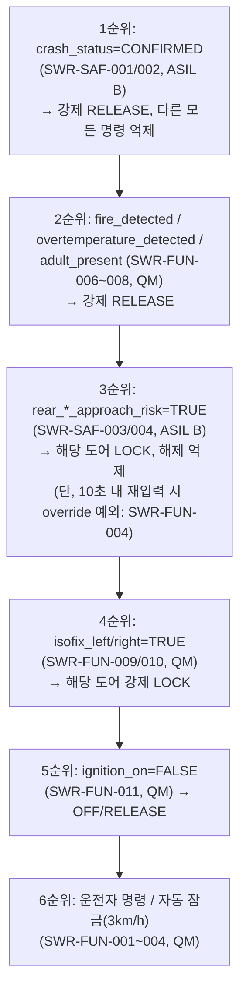
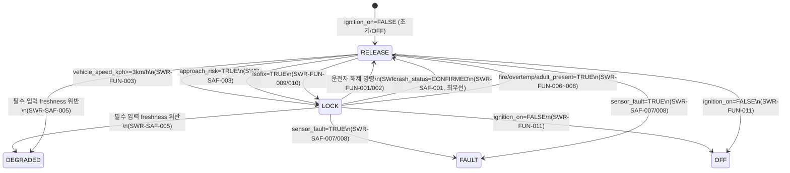

# SWR-001_SW 요구사항 명세서

**전자식 차일드락 제어 SW**

| 항목 | 내용 |
|---|---|
| 문서 ID / 문서명 | SWR-001_SW 요구사항 명세서 |
| Revision | 0.1 (Draft) |
| 프로세스 | A-SPICE SWE.1 |
| 작성일 | 2026-09-18 |
| 입력 문서 | OEM-SWR-001_OEM SW 요구사항 사양서 (Rev 1.0, BL-OEM-1.0), TPL-SWE1-001_SW 요구사항 명세서 템플릿 |
| 작성 조직/역할 | requirements-analyst 서브에이전트 (Claude Code) |
| 문서 상태 | Draft — 1인 바이브 코딩 단계, 기술 검토/승인 미수행 |

> **교육/검토 경계**: 본 문서는 입력 문서(OEM-SWR-001)와 동일하게 품질평가 실습을 위한 가상 프로젝트 산출물이다. 실제 승인, A-SPICE 능력수준, ISO 26262 준수/인증, 양산 적합성을 나타내지 않는다. ASIL 등급은 OEM 입력 문서에서 이미 할당된 값을 그대로 승계했으며, 본 문서에서 HARA/ASIL 도출을 재수행하지 않는다.

## 문서 통제

| 단계 | 책임 역할 | 상태 | 비고 |
|---|---|---|---|
| 작성 | requirements-analyst 서브에이전트 (Claude Code) | 완료 (Draft) | OEM-SWR-001 Rev 1.0 입력 기반 |
| 기술 검토 | (미지정) | 미수행 | 1인 바이브 코딩 단계 — 병합 전 사용자 검토 필요 |
| 승인 | (미지정) | 미수행 | 승인 전까지 Draft 상태 유지 |

### 변경 이력

| Revision | 일자 | 작성/변경자 | 변경 내용 |
|---|---|---|---|
| 0.1 | 2026-09-18 | requirements-analyst 서브에이전트 (Claude Code) | OEM-SWR-001(13개 요구) → SW 요구사항 초안 전개, 최초 작성 |

---

## 1. 목적 및 적용범위

### 1.1 목적

본 문서는 OEM-SWR-001(가상 OEM-A SW 요구사항 사양서)에 정의된 13개 OEM 요구사항(안전 관련 4건, 기능/비기능 9건)을 SW 요구사항 수준으로 전개(분해)하여, 검증 가능한 개별 SW 요구사항 집합과 그 추적성을 정의한다.

### 1.2 적용범위

- 대한민국 판매용 2026년식 가상 OEM-A 승용차의 후석 좌/우 전자식 차일드락 제어 SW
- OEM이 ASIL B로 할당한 안전 관련 SW 요구사항(4.2절)과 QM(Quality Management, 안전 무관) 요구사항(4.1절)을 구분하여 다룬다
- SW-only PC/SIL(Software-in-the-Loop) 참조 구현 및 Web 시뮬레이터 기반 검증을 대상으로 한다
- HARA(위험원 분석 및 위험성 평가), ASIL 도출, ISO 26262 Part 3 활동, ECU/HW 개발, HIL, 실차 시험, 공식 인증 활동은 본 문서의 범위에서 제외한다 (10장 참조)

### 1.3 적용 경계

| 경계 항목 | 적용 여부 | 비고 |
|---|---|---|
| SW-only PC/SIL 및 Web 검증 | 적용 | 결정론적 참조 구현 및 자동시험 대상 |
| ECU/HW, RTOS, HIL, 실차 | 제외 | OEM 입력 문서 1.3절과 동일 경계 승계 |
| ISO 26262 Part 3 (HARA/ASIL 도출) | 제외 | ASIL B는 OEM 문서에서 이미 할당된 값을 그대로 승계(3절 참조) |
| ISO 26262-6 SW 개발 활동 | 부분 적용 | 교육용 목적의 선정 적용, 준수/인증 주장 없음 |
| 실행 환경 | Python 3.14 (PC/SIL 참조 구현)¹ | ¹ OEM 원본 문서(OEM-SWR-001 3장)는 Python 3.12로 표기 — 본 SWR 문서에서 3.14로 갱신하며 원본 표기는 각주로 보존함 |

---

## 2. 요구사항 작성 및 판정 규칙

### 2.1 식별 및 상태 규칙

- SW 요구사항 ID는 `SWR-<분류>-<3자리 순번>` 형식을 사용한다. 분류: `SAF`(안전 관련, ASIL B), `FUN`(기능, QM), `NFR`(비기능, QM).
- 각 요구사항은 상태(초안/검토중/승인/변경) 속성을 가지며, 본 Revision(0.1)의 모든 요구사항은 **초안(Draft)** 상태이다.
- 우선순위는 3장에서 정의하는 상태/우선순위 규칙을 따른다.
- 본 문서의 SWR ID는 OEM 입력 문서 9장에 언급된 "예상 분해 후보"(SWR-001~021, 실체 없음)와 **번호가 일치하지 않으며 독립적으로 새로 부여**되었다. 9장의 후보 매핑은 분해 아이디어 참고용으로만 사용했다.

### 2.2 품질 판정 기준

각 SW 요구사항은 다음 기준(ISO/IEC/IEEE 29148 기반, `requirements-analysis` 스킬 준용)을 만족하는지 자체 판정한다:

- **단일함(Singular)**: 하나의 요구사항에 하나의 검증 가능한 동작만 포함
- **명확함(Unambiguous)**: EARS 5대 패턴 중 하나로 작성되어 모호한 부사 표현이 없음
- **검증 가능함(Verifiable)**: 수용기준이 정량적 임계값과 관측 가능한 출력으로 정의됨
- **완전함(Complete)**: 정상/예외 조건이 모두 다뤄짐 (안전 요구는 고장 대응 포함)
- **추적 가능함(Traceable)**: 상위 OEM 요구 ID로의 역방향 링크를 가짐 (11장)
- **이해 가능함**: 비전문가가 읽어도 동일한 그림을 떠올릴 수 있는 문장 구조 (각 요구사항 하단 자체 점검 표기)

---

## 3. 상태와 우선순위

### 3.1 SW 상태 정의

| 상태 | 의미 |
|---|---|
| `LOCK` | 해당 도어의 차일드락이 활성화(잠금)된 상태 |
| `RELEASE` | 해당 도어의 차일드락이 해제된 상태 |
| `DEGRADED` | 필수 입력의 freshness 조건을 위반하여 판단 신뢰도가 저하된 상태 (SWR-SAF-005) |
| `FAULT` | `sensor_fault=TRUE`로 인해 직전 확정 출력을 유지 중인 상태 (SWR-SAF-007/008) |
| `OFF` | `ignition_on=FALSE`로 인해 초기 해제 상태로 전환된 상태 (SWR-FUN-011) |

### 3.2 명령/조건 우선순위 (제안, OEM 확인 필요)

OEM 입력 문서는 OEM-SR-001(충돌 CONFIRMED 해제)이 "다른 명령보다 우선"한다는 점만 명시하며, 그 외 안전/강제 조건들(접근위험 LOCK, 화재/과온/성인탑승 RELEASE, ISOFIX LOCK, 운전자 override) 간의 상호 우선순위는 OEM 문서에 정의되어 있지 않다. 아래는 각 SWR을 일관되게 해석하기 위한 **제안 순위**이며, **TBD — OEM-A 확인 필요** 항목이다.

> **가정/TBD**: 위 순위는 "안전 관련(ASIL B) 조건이 QM 조건보다 우선한다"는 일반 원칙과 "탈출/구조 관련 강제 해제(화재·과온·성인탑승)가 접근위험 LOCK보다 우선해야 승객 안전에 유리하다"는 상식적 판단을 근거로 제안한 것이며, **OEM-A의 실제 의도를 지어낸 것이 아니다**. 이 순위 확정은 8장의 가정 A-05로 별도 관리하고, OEM-A 확인 전까지 모든 하위 요구사항은 "잠정(provisional)"으로 표시한다.

---

## 4. 기능 및 안전 관련 SW 요구사항

### 4.1 기능 요구사항 (QM)

#### SWR-FUN-001 — 다중 경로 잠금/해제 명령 수신 (← OEM-FR-001)

WHEN 운전자가 `physical_button`, `avn`, `voice`, `mobile_app` 중 하나의 경로로 좌/우/전체 잠금 또는 해제 명령을 입력하면, SW는 해당 명령의 `side`와 `action`을 식별하여 처리해야 한다.

- **수용기준**: 정지 상태, 정상 입력 조건에서 4개 source 각각에 대해 `LOCK`/`RELEASE` × `LEFT`/`RIGHT`/`ALL` 조합이 지정된 도어에만 반영된다.
- **EARS 패턴**: 이벤트 기반 (WHEN) — 명령 수신이라는 단일 트리거에 대한 처리이므로 선택
- **ASIL**: QM
- **검증 수준**: PC/SIL/Web (OEM-FR-001 승계)
- **이해 가능성 자체 점검**: "물리 버튼이든 음성이든 앱이든, 운전자가 어느 문을 잠그거나 열라고 하면 SW가 그 문에만 적용한다"는 그림이 그려짐 — 통과

#### SWR-FUN-002 — 명령의 선택 적용 (← OEM-FR-001)

SW는 SWR-FUN-001에서 수신한 명령을 지정된 `side`(`left`/`right`/`all`)에 해당하는 출력에만 적용하고, 다른 도어의 현재 출력을 변경하지 않아야 한다.

- **EARS 패턴**: 유비쿼터스 — 명령 처리의 일반 규칙이므로 조건 없이 항상 성립
- **ASIL**: QM
- **검증 수준**: PC/SIL/Web

#### SWR-FUN-003 — 주행 시작 시 자동 잠금 (← OEM-FR-002)

WHILE 유효한 `vehicle_speed_kph`가 3 km/h 이상인 동안, SW는 후석 좌/우 차일드락을 `LOCK`으로 설정해야 한다.

- **수용기준**: 유효 차속이 3 km/h 이상이 된 첫 평가주기부터 두 출력이 `LOCK`이다.
- **EARS 패턴**: 상태 기반 (WHILE) — 속도 조건이 지속되는 동안 유지되는 요구이므로 선택
- **ASIL**: QM
- **검증 수준**: PC/SIL

#### SWR-FUN-004 — 접근위험 경고 후 재입력 override (← OEM-FR-003, SWR-SAF-004와 연계)

WHEN 운전자가 SWR-SAF-004에 의해 해제가 억제된 도어에 대해 10초 이하 경과 시점에 동일한 해제 명령을 재입력하면, SW는 이를 명시적 override로 처리하고 override 상태와 이유코드를 생성해야 한다.

- **수용기준**: 최초 억제 시각으로부터 10초 이하 경과 후 같은 도어에 대한 재입력에서 override 상태와 이유코드가 생성된다.
- **EARS 패턴**: 이벤트 기반 (WHEN)
- **ASIL**: QM
- **검증 수준**: PC/SIL/Web
- **비고**: override의 결과 출력이 실제로 `RELEASE`로 전환되는지, 혹은 상태 표시만 하는지는 OEM 원문에 명시되어 있지 않음 → 8장 가정 A-04 참조 (TBD)

#### SWR-FUN-005 — 상태/이유 조회 인터페이스 (← OEM-FR-004)

SW는 좌/우 출력, 현재 상태(3.1절), 입력 유효성, 최근 결정 이유코드를 상태조회 응답으로 제공해야 한다.

- **EARS 패턴**: 유비쿼터스
- **ASIL**: QM
- **검증 수준**: 통합 및 Web

#### SWR-FUN-006 — 화재 감지 시 강제 해제 (← OEM-FR-005)

IF `fire_detected=TRUE`이면, THEN SW는 후석 좌/우 차일드락을 다음 평가주기 내에 `RELEASE`로 전환하고 이유코드를 기록해야 한다.

- **EARS 패턴**: 원치 않는 동작 (IF-THEN)
- **ASIL**: QM (OEM 입력 문서상 QM으로 분류됨 — 화재 상황의 안전 중요성에도 불구하고 OEM이 ASIL을 별도 할당하지 않았으므로 임의로 상향하지 않고 QM 그대로 승계, 8장 확인요청 A-06 참조)
- **검증 수준**: PC/SIL/Web

#### SWR-FUN-007 — 과온 감지 시 강제 해제 (← OEM-FR-005)

IF `overtemperature_detected=TRUE`이면, THEN SW는 후석 좌/우 차일드락을 다음 평가주기 내에 `RELEASE`로 전환하고 이유코드를 기록해야 한다.

- **EARS 패턴**: 원치 않는 동작 (IF-THEN)
- **ASIL**: QM (근거는 SWR-FUN-006과 동일, A-06 참조)
- **검증 수준**: PC/SIL/Web

#### SWR-FUN-008 — 성인 탑승 확인 시 강제 해제 (← OEM-FR-005)

IF `adult_present=TRUE`이면, THEN SW는 후석 좌/우 차일드락을 다음 평가주기 내에 `RELEASE`로 전환하고 이유코드를 기록해야 한다.

- **EARS 패턴**: 원치 않는 동작 (IF-THEN)
- **ASIL**: QM (A-06 참조)
- **검증 수준**: PC/SIL/Web

#### SWR-FUN-009 — 좌측 ISOFIX 연결 시 강제 잠금 (← OEM-FR-006)

WHEN `isofix_left`가 `FALSE`에서 `TRUE`로 전이하면, SW는 다음 평가주기 내에 좌측 차일드락을 `LOCK`으로 전환해야 하며, 우측 출력은 변경하지 않아야 한다.

- **EARS 패턴**: 이벤트 기반 (WHEN)
- **ASIL**: QM
- **검증 수준**: PC/SIL/Web

#### SWR-FUN-010 — 우측 ISOFIX 연결 시 강제 잠금 (← OEM-FR-006)

WHEN `isofix_right`가 `FALSE`에서 `TRUE`로 전이하면, SW는 다음 평가주기 내에 우측 차일드락을 `LOCK`으로 전환해야 하며, 좌측 출력은 변경하지 않아야 한다.

- **EARS 패턴**: 이벤트 기반 (WHEN)
- **ASIL**: QM
- **검증 수준**: PC/SIL/Web

#### SWR-FUN-011 — Ignition Off 시 초기화 (← OEM-FR-007)

WHEN `ignition_on`이 `TRUE`에서 `FALSE`로 전이하면, SW는 좌/우 차일드락 출력을 `RELEASE`로 전환하고 상태를 `OFF`로, 이유코드를 `ignition_off`로 설정해야 한다.

- **EARS 패턴**: 이벤트 기반 (WHEN)
- **ASIL**: QM
- **검증 수준**: PC/SIL/Web

### 4.2 안전 관련 SW 요구사항 (ASIL B)

> 아래 요구사항은 OEM-SR-001~004(ASIL B 입력)로부터 전개되었다. HARA/ASIL 도출은 재수행하지 않으며, ASIL B는 OEM 입력 문서에서 상속된 값이다. 안전 목표(Safety Goal) ID는 OEM 입력 문서에 명시되어 있지 않아 **TBD**로 표기한다(8장 A-01 참조).

#### SWR-SAF-001 — 충돌 확정 시 긴급 해제 (← OEM-SR-001)

WHEN `crash_status`가 `CONFIRMED`로 전이하면, SW는 후석 좌/우 차일드락 출력을 300 ms 이내에 `RELEASE`로 전환해야 한다.

- **수용기준**: 유효 충돌 입력 시 두 출력이 300 ms 이내 `RELEASE`가 된다.
- **EARS 패턴**: 이벤트 기반 (WHEN)
- **ASIL**: B (OEM 입력 문서 승계)
- **안전 목표 추적**: TBD — OEM-A 확인 필요 (8장 A-01)
- **고장 대응/FTTI**: 300 ms를 고장 허용 시간(Fault Tolerant Time Interval)에 준하는 응답 시한으로 취급. 300 ms 초과 시의 자체 진단/2차 조치는 OEM 문서에 정의되어 있지 않아 TBD (8장 A-02)
- **검증 수준**: PC/SIL SW 검증

#### SWR-SAF-002 — 충돌 확정 상태의 해제 유지 및 명령 우선순위 (← OEM-SR-001)

WHILE `crash_status=CONFIRMED`인 동안, SW는 좌/우 출력을 `RELEASE`로 유지해야 하며, 이 기간 중 수신되는 모든 잠금 명령(운전자 명령, 자동 잠금, ISOFIX 등)을 적용하지 않아야 한다.

- **수용기준**: `CONFIRMED` 지속 중 이후 입력 주기에도 `RELEASE`가 유지되고, 동시에 수신된 잠금 요청은 무시되며 그 사유가 기록된다.
- **EARS 패턴**: 상태 기반 (WHILE)
- **ASIL**: B
- **안전 목표 추적**: TBD (8장 A-01)
- **검증 수준**: PC/SIL SW 검증

#### SWR-SAF-003 — 후측방 접근위험 도어 잠금 (← OEM-SR-002)

WHEN 특정 도어의 `rear_*_approach_risk`가 `TRUE`가 되면, SW는 해당 도어의 차일드락 출력을 `LOCK`으로 설정해야 한다.

- **EARS 패턴**: 이벤트 기반 (WHEN)
- **ASIL**: B
- **안전 목표 추적**: TBD (8장 A-01)
- **검증 수준**: PC/SIL SW 검증

#### SWR-SAF-004 — 접근위험 상태의 해제 요청 억제 (← OEM-SR-002)

WHILE 특정 도어의 `rear_*_approach_risk=TRUE`인 동안, SW는 해당 도어에 대한 해제 요청을 억제하고 `LOCK`을 유지해야 하며, 억제 사유를 기록해야 한다 (SWR-FUN-004의 10초 override 예외 제외).

- **수용기준**: 접근위험 `TRUE`가 되면 해당 출력이 `LOCK`이고, 이후 `RELEASE` 요청에도 `LOCK`을 유지하며 원인이 기록된다.
- **EARS 패턴**: 상태 기반 (WHILE)
- **ASIL**: B
- **안전 목표 추적**: TBD (8장 A-01)
- **검증 수준**: PC/SIL SW 검증

#### SWR-SAF-005 — 필수 입력 freshness 감시 및 저하 상태 전이 (← OEM-SR-003)

IF 안전 관련 필수 입력이 200 ms를 초과하여 갱신되지 않으면, THEN SW는 100 ms 이내에 해당 판단 영역을 `DEGRADED` 상태로 전환해야 한다.

- **수용기준**: freshness 위반 발생 후 100 ms 이내 `DEGRADED` 상태가 된다.
- **EARS 패턴**: 원치 않는 동작 (IF-THEN)
- **ASIL**: B
- **안전 목표 추적**: TBD (8장 A-01)
- **고장 대응**: `DEGRADED` 상태에서의 출력 값(직전 값 유지/안전 상태 강제 등)은 OEM 문서에 명시되어 있지 않아 TBD (8장 A-03)
- **검증 수준**: 단위 및 PC/SIL

#### SWR-SAF-006 — 입력 형식/범위 오류 거절 (← OEM-SR-003)

IF 수신된 안전 관련 입력이 정의된 형식 또는 범위를 벗어나면, THEN SW는 해당 값을 평가에 사용하지 않고 `INVALID`로 처리해야 한다.

- **EARS 패턴**: 원치 않는 동작 (IF-THEN)
- **ASIL**: B
- **안전 목표 추적**: TBD (8장 A-01)
- **검증 수준**: 단위 및 PC/SIL

#### SWR-SAF-007 — 센서 고장 시 직전 출력 유지 (← OEM-SR-004)

IF 정규화된 입력의 `sensor_fault=TRUE`이면, THEN SW는 새로 수신된 명령을 적용하지 않고 직전 확정된 좌/우 출력을 유지해야 한다.

- **수용기준**: `sensor_fault=TRUE`가 된 첫 평가주기에 좌/우 출력이 유지된다.
- **EARS 패턴**: 원치 않는 동작 (IF-THEN)
- **ASIL**: B
- **안전 목표 추적**: TBD (8장 A-01)
- **검증 수준**: 단위 및 PC/SIL

#### SWR-SAF-008 — 센서 고장 상태 및 경고코드 제공 (← OEM-SR-004)

IF `sensor_fault=TRUE`이면, THEN SW는 상태를 `FAULT`로 설정하고 경고코드를 상태조회 인터페이스(SWR-FUN-005)에 제공해야 한다.

- **EARS 패턴**: 원치 않는 동작 (IF-THEN)
- **ASIL**: B
- **안전 목표 추적**: TBD (8장 A-01)
- **검증 수준**: 단위 및 PC/SIL

---

## 5. 입력 데이터 사전

아래는 OEM-IF-001~009(6장 인터페이스 계약)에서 참조되는 모든 데이터 필드를 정리한 것이다. 방향은 6장의 인터페이스 방향을 그대로 표기한다.

| 필드명 | 자료형 | 단위/허용값 | 범위/유효성 조건 | 방향 (근거 IF) |
|---|---|---|---|---|
| `vehicle_speed_kph` | float | km/h | 0.0 ~ 300.0 | Vehicle→SW (IF-001) |
| `gear` | enum | P / N / D / R | 정의된 4개 값 외 `INVALID` | Vehicle→SW (IF-001) |
| `source_timestamp_s` | float | 초(s) | 형식 오류 시 `INVALID` (구체 스키마 TBD, 8장 A-07) | Vehicle→SW (IF-001) |
| `crash_status` | enum | NONE / PENDING / CONFIRMED | 미정 값 `INVALID` | Vehicle→SW (IF-002) |
| `rear_left_approach_risk` | boolean | true/false | 누락, 형식 오류 시 `INVALID` | Vehicle→SW (IF-003) |
| `rear_right_approach_risk` | boolean | true/false | 누락, 형식 오류 시 `INVALID` | Vehicle→SW (IF-003) |
| `side` | enum | left / right / all | 미등록 enum 거절 | Driver→SW (IF-004) |
| `action` | enum | lock / unlock | 미등록 enum 거절 | Driver→SW (IF-004) |
| `source` | enum | physical_button / avn / voice / mobile_app | 미등록 enum 거절 | Driver→SW (IF-004) |
| `lock_left` | enum | LOCK / RELEASE | — | SW→Actuator model (IF-005) |
| `lock_right` | enum | LOCK / RELEASE | — | SW→Actuator model (IF-005) |
| `state` | enum | (3.1절 상태값: LOCK/RELEASE/DEGRADED/FAULT/OFF 등) | 직렬화 실패 시 HTTP 500 | SW→Display (IF-006) |
| `priority_reason` | string/enum | — | `reason_code`로도 매핑됨 | SW→Display (IF-006) |
| `reason_code` | string | — | — | SW→Display (IF-006) |
| `input_validity` | enum | — | — | SW→Display (IF-006) |
| `fire_detected` | boolean | true/false | 누락, 형식 오류 시 `INVALID` | Vehicle→SW (IF-007) |
| `overtemperature_detected` | boolean | true/false | 누락, 형식 오류 시 `INVALID` | Vehicle→SW (IF-007) |
| `adult_present` | boolean | true/false | 누락, 형식 오류 시 `INVALID` | Vehicle→SW (IF-007) |
| `isofix_left` | boolean | true/false | 누락, 형식 오류 시 `INVALID` | Vehicle→SW (IF-008) |
| `isofix_right` | boolean | true/false | 누락, 형식 오류 시 `INVALID` | Vehicle→SW (IF-008) |
| `ignition_on` | boolean | true/false | 누락, 형식 오류 시 `INVALID` | Vehicle→SW (IF-009) |
| `sensor_fault` | boolean | true/false | 누락, 형식 오류 시 `INVALID` | Vehicle→SW (IF-009) |

---

## 6. 외부 인터페이스 요구

OEM-SWR-001 6장의 인터페이스 계약을 그대로 승계한다 (임의 변경 없음).

| 인터페이스 ID | 방향 | 주요 데이터 | 단위/범위 | 오류 처리 |
|---|---|---|---|---|
| OEM-IF-001 | Vehicle→SW | vehicle_speed_kph, gear, source_timestamp_s | km/h 0.0~300.0; P/N/D/R; s | 누락, 형식, 범위 오류 → `INVALID` |
| OEM-IF-002 | Vehicle→SW | crash_status | NONE/PENDING/CONFIRMED | 미정 값 → `INVALID` |
| OEM-IF-003 | Vehicle→SW | rear_left_approach_risk, rear_right_approach_risk | boolean | 누락, 형식 오류 → `INVALID` |
| OEM-IF-004 | Driver→SW | side, action, source | left/right/all; lock/unlock; physical_button/avn/voice/mobile_app | 누락, 형식, 미등록 enum 거절; 요청 시각은 `VehicleSnapshot.timestamp_s` 사용 (스키마 TBD, 8장 A-07) |
| OEM-IF-005 | SW→Actuator model | lock_left/right | LOCK/RELEASE | PC/SIL 논리 출력까지만 검증; 적용 feedback은 범위 밖 |
| OEM-IF-006 | SW→Display | state, priority_reason, reason_code, input_validity | enumeration/string | `priority_reason`을 `reason_code`로도 매핑; 직렬화 실패는 HTTP 500 |
| OEM-IF-007 | Vehicle→SW | fire_detected, overtemperature_detected, adult_present | boolean | 누락, 형식 오류 → `INVALID` |
| OEM-IF-008 | Vehicle→SW | isofix_left/right | boolean | 누락, 형식 오류 → `INVALID` |
| OEM-IF-009 | Vehicle→SW | ignition_on, sensor_fault | boolean | 누락, 형식 오류 → `INVALID` |

---

## 7. 비기능 및 환경 제약

ISO/IEC 25010 특성으로 분류하고, `nfr-iso25010.md`의 "검증 방안 선택 기준"을 통과한 방안만 제시한다.

#### SWR-NFR-001 — 결정론적 재현성 (← OEM-NFR-001)

SW는 동일한 입력 순서와 동일한 초기 상태가 주어지면 항상 동일한 제어결과를 생성해야 한다.

- **ISO 25010 특성**: 기능 적합성 — 정확성(Functional Correctness) (동일 입력에 대한 결과 일관성)
- **EARS 패턴**: 유비쿼터스
- **정량 기준**: 고정 시계(fixed clock) 기준, 동일 입력 벡터를 1,000회 재생했을 때 공개 결과(출력 시퀀스)의 해시값이 모두 일치
- **검증 방안**: PC/SIL 참조 구현에서 고정 시계로 동일 입력 벡터를 1,000회 반복 실행하고 결과 해시를 비교하는 자동화 회귀 테스트 (도구: 해시 비교를 포함한 unittest 기반 재생 테스트, 실제 확보 가능한 수단) — 재현 가능, 판정 기준(해시 일치/불일치)이 이분법적으로 명확, 프로젝트 규모(PC/SIL)에 비례
- **검증 수준**: PC/SIL

#### SWR-NFR-002 — 결정 로그 보존 개수 제한 (← OEM-NFR-002)

SW는 최근 제어결정 100건을 메모리 내 저장소(ring buffer)에 순서대로 보존해야 한다.

- **ISO 25010 특성**: 성능 효율성 — 자원 활용성(Resource Utilization) (메모리 사용량을 100건으로 제한)
- **EARS 패턴**: 유비쿼터스
- **정량 기준**: 101건째 입력 후 최신 100건만 순서대로 조회 가능
- **검증 방안**: 단위/통합 테스트에서 101건의 결정 이벤트를 순차 주입한 뒤 조회 API 결과가 최신 100건·순서·건수와 일치하는지 자동 검증 (unittest, PC/SIL 환경에서 실제 실행 가능)
- **검증 수준**: 단위 및 통합

#### SWR-NFR-003 — 영상/음성/개인식별정보 미저장 (← OEM-NFR-002, 프로젝트 제약)

SW는 결정 로그에 영상 원본, 음성 원본, 개인 식별정보를 저장하지 않아야 하며, 성인 탑승 여부는 불리언 시험신호(`adult_present`)로만 표현해야 한다.

- **ISO 25010 특성**: 보안성 — 기밀성(Confidentiality) / 데이터 최소화
- **EARS 패턴**: 유비쿼터스
- **정량 기준**: 로그 레코드의 필드 스키마가 사전 정의된 허용 필드 목록(8장 참조)만 포함
- **검증 방안**: 로그 레코드 스키마에 대한 코드/설계 리뷰 및 자동화된 필드 화이트리스트 검사(허용되지 않은 필드가 직렬화되면 테스트 실패) — 재현 가능, 이분법적 판정 가능, PC/SIL 규모에 비례
- **검증 수준**: 단위 및 통합

#### SWR-NFR-004 — 프로세스 재기동 시 로그 휘발성 (← OEM-NFR-002)

SW는 프로세스가 재기동되면 이전 결정 로그를 보존하지 않아야 한다(메모리 내 저장소이며 영속 저장소를 사용하지 않음).

- **ISO 25010 특성**: 보안성 — 기밀성(Confidentiality) (비영속성을 통한 데이터 노출 최소화)
- **EARS 패턴**: 유비쿼터스
- **정량 기준**: 101건 입력 후 프로세스 재기동 시 조회 결과 0건
- **검증 방안**: 통합 테스트에서 로그 적재 후 프로세스를 재기동하고 조회 API가 빈 결과를 반환하는지 확인 (PC/SIL 환경에서 실제 실행 가능)
- **검증 수준**: 단위 및 통합

### 7.1 환경 제약

| 항목 | 내용 |
|---|---|
| 실행 환경 | Python 3.14 (PC/SIL 참조 구현)¹ |
| 대상 플랫폼 | PC/SIL, Web 시뮬레이터 |
| 제외 환경 | 양산 ECU, RTOS, HIL, 실차 |

¹ OEM 입력 문서(OEM-SWR-001) 3장은 실행 환경을 Python 3.12로 표기하였으나, 본 프로젝트의 개발 환경 정책(CLAUDE.md)에 따라 Python 3.14로 갱신하여 적용한다.

---

## 8. 분석 결과와 가정

모호하거나 OEM 입력 문서에 정의되지 않은 사항은 임의로 확정하지 않고 아래와 같이 가정(Assumption) 또는 TBD로 명시한다. **모두 OEM-A 확인이 필요한 갭이다.**

| ID | 항목 | 현재 처리 | 확인 요청 |
|---|---|---|---|
| A-01 | 안전 목표(Safety Goal) ID | OEM 입력 문서에 Safety Goal ID가 제공되지 않음 | TBD — SWR-SAF-001~008이 추적할 Safety Goal ID/명칭을 OEM-A가 제공해야 함 |
| A-02 | 300 ms(SWR-SAF-001) 초과 시 2차 조치 | 정의되지 않음 | TBD — FTTI 초과 시 안전 상태 강제 여부 등 후속 동작 확인 필요 |
| A-03 | `DEGRADED` 상태에서의 출력 값 정책 | 정의되지 않음 (직전 값 유지 vs 안전측 강제 LOCK/RELEASE 등) | TBD — OEM-A 확인 필요 |
| A-04 | SWR-FUN-004 override의 실제 출력 전환 여부 | OEM 원문은 "override 상태와 이유코드 생성"만 명시, 실제 `RELEASE` 전환 여부 불명 | TBD — override가 실제 잠금 해제로 이어지는지 확인 필요 |
| A-05 | 3.2절 명령/조건 간 우선순위 | OEM 문서는 OEM-SR-001(충돌)의 최우선순위만 명시 | TBD — 접근위험/화재·과온·성인탑승/ISOFIX/override 간 상호 우선순위를 OEM-A가 확정해야 함 (제안안은 3.2절 참조, 지어낸 값이 아님을 표기) |
| A-06 | 화재/과온/성인탑승(OEM-FR-005)의 ASIL 분류 | OEM 문서상 QM으로 명시됨 | 확인요청 — 승객 탈출 관련 강제해제 기능임에도 QM으로 유지되는 것이 OEM-A의 의도인지 확인 권장 (임의로 ASIL 상향하지 않음) |
| A-07 | `VehicleSnapshot.timestamp_s` 스키마(OEM-IF-004) | OEM 원문에 데이터 구조가 정의되어 있지 않음 | TBD — `source_timestamp_s`와의 관계, 형식(정수/실수, epoch 기준 등) 확인 필요 |
| A-08 | 이유코드(`reason_code`)/우선순위 사유(`priority_reason`) 값 집합 | 값의 전체 목록이 OEM 문서에 정의되어 있지 않음 | TBD — 코드 값 사전은 설계 단계에서 SWR 각 항목의 "이유코드" 언급과 함께 확정 필요 |
| A-09 | 대한민국 법규 적용성(자동차규칙 별표14 등) | 범위 제외 | **해당없음/TBD** — OEM 입력 문서 7장의 범위 제외 결정을 그대로 승계, 본 SWR 문서에서 재론하지 않음 |

---

## 9. 하향 할당 및 검증 계획

아키텍처/구현 Phase 배정은 아직 이루어지지 않았으므로(TBD), 아래는 OEM 입력 문서로부터 승계한 **검증 수준**만 명시한다. 아키텍처 배정(SWE.2) 이후 본 표는 갱신되어야 한다.

| SWR ID | 검증 수준 | 아키텍처/구현 Phase |
|---|---|---|
| SWR-SAF-001, SWR-SAF-002 | PC/SIL SW 검증 | TBD |
| SWR-SAF-003, SWR-SAF-004 | PC/SIL SW 검증 | TBD |
| SWR-SAF-005, SWR-SAF-006 | 단위 및 PC/SIL | TBD |
| SWR-SAF-007, SWR-SAF-008 | 단위 및 PC/SIL | TBD |
| SWR-FUN-001, SWR-FUN-002 | PC/SIL/Web | TBD |
| SWR-FUN-003 | PC/SIL | TBD |
| SWR-FUN-004 | PC/SIL/Web | TBD |
| SWR-FUN-005 | 통합 및 Web | TBD |
| SWR-FUN-006, SWR-FUN-007, SWR-FUN-008 | PC/SIL/Web | TBD |
| SWR-FUN-009, SWR-FUN-010 | PC/SIL/Web | TBD |
| SWR-FUN-011 | PC/SIL/Web | TBD |
| SWR-NFR-001 | PC/SIL | TBD |
| SWR-NFR-002, SWR-NFR-003, SWR-NFR-004 | 단위 및 통합 | TBD |

---

## 10. 범위 밖 주장

본 문서는 다음을 포함하거나 주장하지 않으며, OEM 입력 문서(1.2/1.3/2장)의 경계를 그대로 승계한다:

- HARA(위험원 분석 및 위험성 평가) 및 ASIL 도출 근거 재구성 — ASIL B는 OEM 입력값을 그대로 승계
- ISO 26262 Part 3 활동 (아이템 정의, HARA, 안전 목표 도출)
- ECU/HW 개발, RTOS, HIL 시험, 실차 시험
- 공식 심사, 인증, 양산 적합성 평가
- 대한민국 법규(자동차규칙 별표14 등) 적용성 판단 — **해당없음/TBD**, OEM-A 인증 담당의 별도 확인 필요 (8장 A-09)
- 도어 래치/구동기 물리 안전, CAN/LIN 드라이버 등 전기적 구현 세부사항
- 실제 OEM 승인/승인 상태 — 본 문서는 Draft이며 기술 검토·승인 미수행

---

## 11. 추적성

### 11.1 상위(OEM) ↔ 본 SWR 양방향 추적

| OEM ID | ASIL/분류 | 하위 SWR ID |
|---|---|---|
| OEM-SR-001 | ASIL B | SWR-SAF-001, SWR-SAF-002 |
| OEM-SR-002 | ASIL B | SWR-SAF-003, SWR-SAF-004 |
| OEM-SR-003 | ASIL B | SWR-SAF-005, SWR-SAF-006 |
| OEM-SR-004 | ASIL B | SWR-SAF-007, SWR-SAF-008 |
| OEM-FR-001 | QM | SWR-FUN-001, SWR-FUN-002 |
| OEM-FR-002 | QM | SWR-FUN-003 |
| OEM-FR-003 | QM | SWR-FUN-004 |
| OEM-FR-004 | QM | SWR-FUN-005 |
| OEM-FR-005 | QM | SWR-FUN-006, SWR-FUN-007, SWR-FUN-008 |
| OEM-FR-006 | QM | SWR-FUN-009, SWR-FUN-010 |
| OEM-FR-007 | QM | SWR-FUN-011 |
| OEM-NFR-001 | QM | SWR-NFR-001 |
| OEM-NFR-002 | QM | SWR-NFR-002, SWR-NFR-003, SWR-NFR-004 |

모든 OEM 요구사항(13건)이 최소 1개 이상의 SWR로 전개되어 역방향 추적 갭 없음.

### 11.2 하위(설계/테스트) 추적 — 갭으로 명시

본 문서 작성 시점에는 아키텍처 설계(SWE.2)·상세설계(SWE.3)·테스트 케이스가 아직 존재하지 않는다. 따라서 **모든 SWR-xxx 요구사항은 하위 설계 요소/테스트 케이스로의 추적 링크가 없는 상태이며, 이는 완성되지 않은 갭으로 명시한다.** architecture-designer/detailed-designer/coding/integration-tester/sw-system-tester 서브에이전트의 산출물이 생성되는 시점에 본 표를 갱신해야 한다.

| SWR ID | 하위 설계 요소 | 하위 테스트 케이스 |
|---|---|---|
| (전체 SWR-xxx, 23건) | TBD (아키텍처 설계 이후 확정) | TBD (통합/시스템 테스트 설계 이후 확정) |

### 11.3 추적 관계 시각화 제안

OEM ID 1건이 다수 SWR로 분해되는 관계(1:N)가 많아 표로도 파악 가능하나, 향후 하위 설계/테스트까지 포함한 3단 추적(OEM→SWR→설계/테스트)이 확정되면 SysML Requirement Diagram으로 시각화할 것을 제안한다 (`uml-sysml-notation.md` 참조).

---

## 12. 참고자료

- OEM-SWR-001_OEM SW 요구사항 사양서 (Rev 1.0, BL-OEM-1.0) — 본 SWR 문서의 상위 입력
- TPL-SWE1-001_SW 요구사항 명세서 템플릿 — 본 문서 목차 구조의 근거
- ISO/IEC/IEEE 29148 (요구사항 공학 원칙, 공개적으로 알려진 원칙 재구성 참조)
- ISO 26262 (도로차량 기능안전, Part 6 SW 개발 관점 선정 적용)
- ISO/IEC 25010 (SW 제품 품질 특성 모델, 7장 비기능 요구사항 분류 근거)
- 2026 GN7 및 Model Y 2025+ 한국어 공식 사용자 매뉴얼 공개 기능 설명 (2026-08-23 관찰) — **참고 목적에만 사용, 본 문서의 수치/인터페이스/안전분류의 근거로 사용하지 않음** (OEM 입력 문서 2장 경계 승계)

---

## 부록: 상태 전이 개념도 (참고용)

여러 조건이 하나의 출력 상태를 두고 경합하는 구조이므로, 이해를 돕기 위해 개념적 상태 전이도를 제시한다 (정확한 우선순위는 3.2절/8장 A-05 확정 전까지 잠정임).

